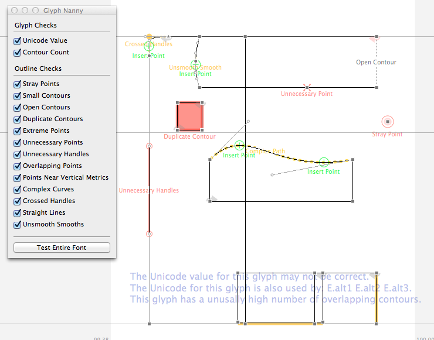

# Glyph Nanny

This tool provides live feedback about the technical quality of a glyph. The goal is to help new type designers get through the "Beziers Are Frustrating!" phase a little more quickly. Keep in mind that the displayed notes and marks are generated by math and are not a definitive list of things that *must* be corrected. It's always (okay, not always) acceptable to break the rules as long as you have a good reason. Think of the comments as reminders to think through why you have things where they are.

If you want to turn the display on or off, or edit the list of tests performed, look under Extensions > Glyph Nanny in the application menu.

Also located under Extensions > Glyph Nanny in the application menu is an option for testing an entire font.

## Versions

### 0.3

- The font report is now formatted HTML, with marked up glyph images, instead of a text dump.
- Removed the "unusually high number of contours" test. It took an unusually high number of seconds to execute.
- Added a new test that looks for slightly asymmetric, adjacent curves.
- Added a new test that looks for slight stem width inconsistencies. This uses the Stem Snap values defined in the PostScript hinting settings to determine the desired stem widths.
- The vertical metrics alignment test now incorporates blue zones in the evaluation ranges.
- Unnamed anchors are now caught by the stray point test.
- When testing a full font, overlapping data can now be ignored.
- The crossed handle test is now more lenient when a curve is very small.
- The text in the displayed report can now be turned off.
- Improved speed. (Results may vary.)
- Improved report aesthetics. (Opinions may vary.)
- Small bug fixes.

### 0.2

Minor bug fixes.

### 0.1

Initial version.